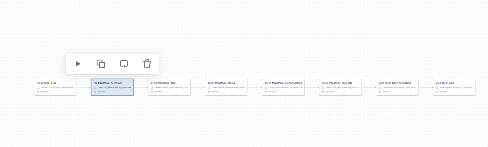
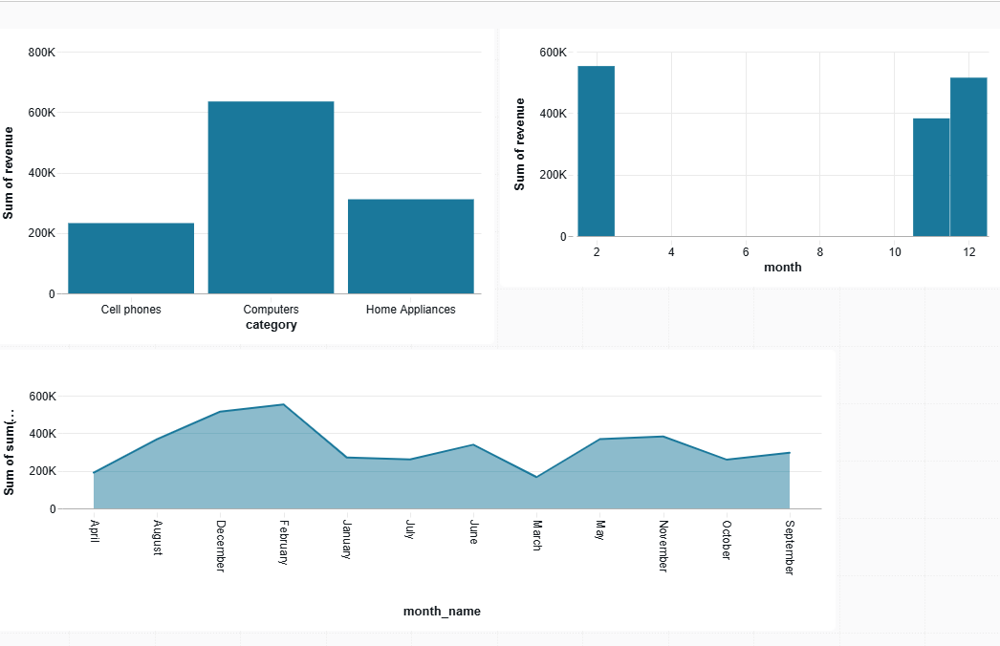

#Electronics Retailer Case Study: KPI Analysis Documentation
#Overview
###This case study involves analyzing sales data from a global electronics retailer to derive key performance indicators (KPIs) that inform operational and strategic decisions. The analysis leverages five core datasets:

###Sales: Transaction records including order details, date, customer, store, product, and delivery info.
###Customers: Customer demographics and geographic information.
###Products: Product categories, descriptions, and identifiers.
###Stores: Store locations, countries, and related info.
###Exchange Rates: Currency conversion rates per date.

#Architecture View

         Bronze Layer - Getting as it is
         Silver Layer - Cleaning the data
         Gold Layer - Tansforming the data

#Bronze Overview
##Bronze Layer: Raw Data Ingestion

###Purpose: Collect and store raw data directly from source systems.
##Content:
###Raw tables from source systems:
Sales
Customers
Products
Stores
Exchange Rates

###Actions:
Data ingestion without transformations.
Store in data lake or raw database.

#Silver Overview
##Silver Layer: Cleansed and Joined Data

##Purpose: Clean, validate, and integrate raw data to create a unified dataset.
##Transformations:
Handle missing data (e.g., missing store info, missing exchange rates).
Standardize date formats.
Convert all prices to USD using exchange rates.
Create derived fields:
OrderMonth, OrderQuarter.
DeliveryTime (if not directly available).

Join tables:
Merge Sales with Products, Customers, Stores, Exchange Rates.
Gold Layer: Aggregated and Analytical Data

#Gold Overview
##Gold Layer: Ready to use data

##Purpose: Generate KPIs, summaries, and insights for reporting.
##Transformations:
Aggregate data for specific KPIs:
Monthly revenue.
Top categories by revenue and volume.
Customer statistics.
Delivery performance metrics.

##Outcome:
Ready-to-use datasets for dashboards, reports, and detailed analysis.

##Orchestaration 

#Visualization

